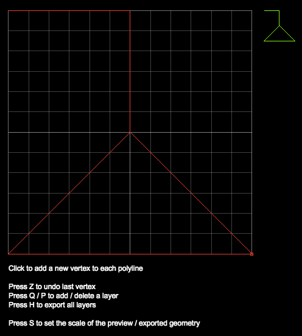

# Celestial Combat

 

Celestial Combat is a game of galactic trade, colonization, and conquest. 

See this page for [How to Play](src/how-to-play.md) this game.

By appending certain strings to the launch URL, you may also:
 - load up straight into the game with `?game`
 - enter the polygon editor with `?editor` 

## TODOs to finish v1

- message box at the bottom right
    - "planet X1 has been claimed"
    - "new weapon constructed"
    - "New friendly fighter constructed on planet X1"
    - "Planet X1 has been colonized"
    - "Planet G5 is under attack"

- special button when docked to planet:
    - set planet as preferred respawn point
    - replace current weapon

- complete basic fighter AI
    - land on spaceport
    - land on planet

- way to track who killed what
    - earn XP
    - rank up with XP

- shields
    - around all turret locations
    - PBase, Freighter, SpacePort shields

- tutorial sector
    - only planet to colonize is a planet with defunct colony and fighter 

## BACKLOG

- dedicated drop-ship unit

- drop off ground forces (probes) to attack enemy planet facilities
    - armies bounded to surface of a planet

- high score board

- structured strategic enemy AI (possibly use btrees here)
    - 1st order
        - move to point
        - move to point + maintain distance away from point (radius)
        - move, avoiding stars and planets
    - 2nd order
        - attack planet
        - attack enemy fighter
        - intercept enemy colonization attempt
        - retreat to nearest friendly planet
        - dock on friendly planet
        - dock on friendly spaceport
        - request backup
        - defend entity (move + maintain dist, + attack enemies within range)
        - seek unoccupied planets to land on
        - coordinated attack with fighters in groups
        - assign priority to targets

- Custom key mapping

- better HUD
    - landing speed indicator
    - nearest star / nearest planet is like the enemy indicator from XEvil (screen borders)
    - make a more advanced galaxy radar

- special button when docked to planet:
    - pick up unused upgrades
    - drop unused upgrades

- special button when near non-friendly planet
    - negotiate treaty
    - buy / sell resources

- cloaking device
    - one time use (actively cloaked until ship is damaged or fires a weapon)

- vector win / loss symbols    

- save / load games

- probes (alien craft?)

- more spacecraft
    - light fighter
    - escort guard 
    - heavy fighter
    - capital ships
    - viral (T4) shaped ships

- mercenary gameplay
    - bid / accept jobs
    - manage fleet
    - purchase / upgrade facilities

- different mission objectives
    - raiding
        - steal weapon from enemy PLab
        - steal finished goods
    - vengeance
    - infiltration
        - hijack spaceport and use it to destroy planet facilities
        - land saboteurs on planet to reduce production
        - land saboteurs on planet to reduce production
 

- implement structure status displays
- asteroids / uninhabitable worlds
- ability to destroy planets