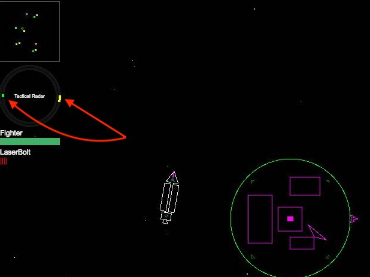
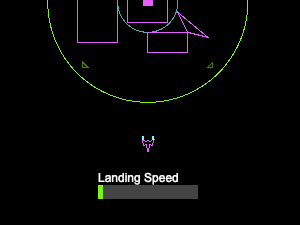

# Improving HUD indicator designs
_Tags: #design #UX_
 
Written 2018-01-02

Game design is essentially UX design. Bad experience design is more than jarring: it drives beginner players
away. CelCom previously had an example of bad experience design in one of it core gameplay mechanics:
landing spaceships was awkward and difficult. First you needed to be able to find the planet you want to land on, 
then you had to move to it, possibly avoiding other planets and stars en route.

## Landing fighters

Landing a fighter spaceship is a basic action that the player has to do in order to lay claim to planets,
re-arm weapons with ammo supplies, and repair their ship. This skill is one of the core mechanics
of the game.

Parking up on a planet is the successful outcome of a landing, the alternative is certain death.
Two factors decide if you make it or not:

1. You have to orient the ship so that it faces outward from center of the planet
2. Your speed at the moment of contact with the planet's surface needs to be low enough to survive the landing

## Previous design

Previously the UI used a dial indicator. Colored arcs would rotate within two concentric
circular tracks to visualize the angle from the ship to the nearest star and the nearest planet.



The main problem with this display was its skeuomorphism: in a real spacecraft you may have dials and controls
that you may have to look at in order to ascertain information about your vessel. At best, bearing indicators 
may be visible via a HUD but this is fundamentally different from the perspective of the player in the game. 


Additionally, the player had to land fighters without a speed indicator, purely using the
movement of the background star field and relative motion of the stars as their speedometer. General feedback
from players was that these conditions would often result in very few successful landings and not much fun.

Landing was supposed to be hard, but not that hard.

## Improved design

Top-down perspective is a 3rd-person view, while dials and meters are usually 1st-person UI elements; two distinct
ways to show vital information. Maybe we could borrow a concept for a heading indicator from other games with this
perspective?

  

- GTA1 uses a yellow arrow that follows the player sprite around and points to the next objective. This
was a good start, but was too limiting for Celestial Combat. Due to the sparsity of the graphics,
putting a set of always visible dials near center of the screen would probably obscure visual focus and annoy the player. 
We can't use this design as is.


- [XEvil](https://www.xevil.com) uses an enemy indicator that follows the enemy around the edges of
the game screen if the enemy is out of view and disappears when the enemy is in view. This was
a much better design to replace the old dials in Celestial Combat.

A new landing speed indicator was set to be shown only when the fighter ship was within 
a certain distance of a planet, following the "get-out-of-the-way" philosophy. Crashing speed was also set a little higher.
The game would allow for rougher landings to avoid discouraging players. 



## Coding the new design for the indicators

We ended up coding 4 distinct indicators for this UI component:

1. Nearest planet (green diamond)
2. Nearest star (yellow diamond) 
3. Targeted object (red crosshair)
4. Checkpoint (blue letter "N")

The indicators only appear at the edges of the viewport. The most complicated part of implementing this UI was
projecting the various positions (in game space) to the border of the viewport (in HUD space). 
 
But since the viewport is a rectangle there are only 4 cases we need to consider. Indicator should be shown:

1. At the TOP border: Y value is known, just need to calculate X
2. At the BOTTOM border: Y value is known, just need to calculate X
3. At the LEFT border: X value is known, just need to calculate Y
4. At the RIGHT border: X value is known, just need to calculate Y

Pseudocode for the function `drawPointerFor()` which is responsible for this:

```
    if target is outside viewport
        show pointer
    
        dx = X distance between target and the center of the screen 
        dy = Y distance between target and the center of the screen
        
        calculate and store aspect ratio of dx, dy
        
        // Cases 3 and 4 handled:
        // Pointer will be shown at either the LEFT or RIGHT edge of the screen
        if target aspect ratio > screen aspect ratio
            if dx > 0
                pointer X = right edge of the screen
            else
                pointer X = left edge of the screen
                
            pointer Y = 1 / target aspect ratio * pointer X
         
         // Cases 1 and 2 handled:
         // Pointer will be shown at either the TOP or BOTTOM of the screen
         else if target aspect ratio < screen aspect ratio
            if dy > 0
                pointer Y = bottom edge of the screen
            else
                pointer Y = top edge of the screen
                
            pointer X = target aspect ratio * pointer Y         
    else 
        hide pointer
```

Full source code for the pointer UI resides in [`src/client/GameScreen/HUD/Pointers.ts`](https://github.com/jsyang/celestial/blob/master/src/client/GameScreen/HUD/Pointers.ts).
Feedback for these changes was definitely positive. We can expect to implement more UX design improvements in the future!