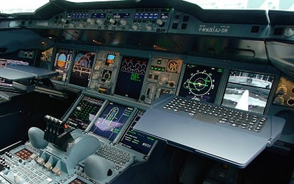
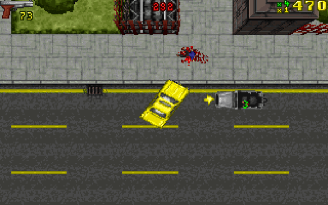
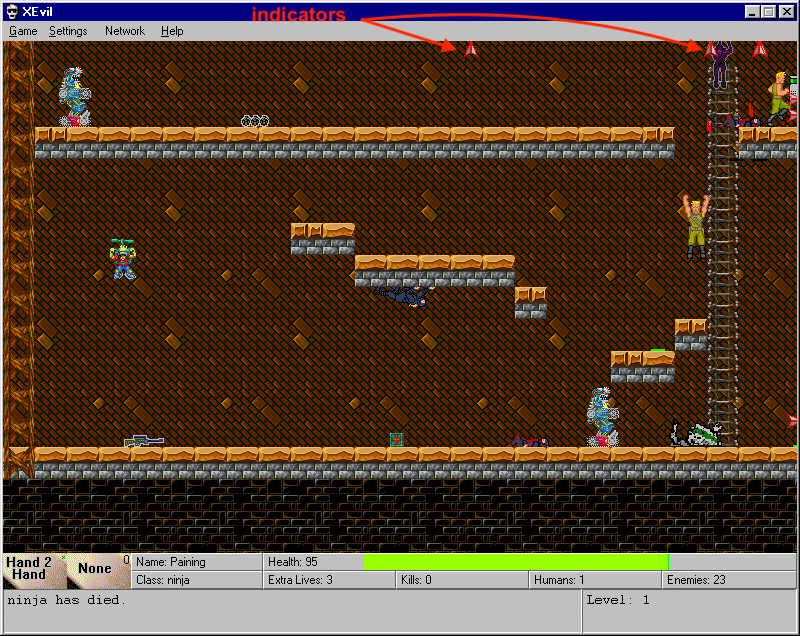

# HUD Indicator designs
_Tags: #design #UX_
 
2018-12-xx

UX design is everything in the realm of games and when something is lacking in that
department, it stands out. CelCom has had an example of this where everything about
the game experience around landing on and avoiding celestial bodies was unintuitive
and awkward to face.

## Landing fighters

As part of winning the game, the player might need to land on planets in order to re-arm and
repair your fighter spaceship or to mark an enemy planet as a colonization target.
The mechanic of landing is crucial to gameplay.

To land, you first have to orient the ship so that it faces outward from center
of the planet and then reduce speed so that it's below the safe landing threshold. Trying
to land without doing that will result in a crashed ship.

## Previous design

The previous design used a dial indicator for the nearest star and planet, it looked like this:


The main problem with this display was its skeuomorphism: in a real spacecraft you don't have a
HUD, instead you have a set of controls and displays that you may have to look at in order to
ascertain information about your vessel. At best bearing indicators may be visible via a HUD but this
is fundamentally different from the perspective of the game (third person vs first person).



Additionally, the player had to land fighters without a speed indicator, purely using the
movement of the background starfield and relative motion of the stars as speedometer. Feedback
from players was that these conditions would often result in very few successful landings.

Landing was supposed to be hard, but not that hard.  

## New design

Because the game screen *is* the world and the HUD is part of the game screen, there are
more allowances to merge first-person metaphors into this display. CelCom has a third-person 
top-down view; perhaps we could borrow a concept for a heading indicator from other games with this
perspective.

  

- GTA1 uses a yellow arrow that follows the player sprite around and points to the next objective. This
was a good start, but was too limiting for Celestial Combat. Due to the sparsity of the graphics,
putting a set of always visible dials near center of the screen would probably annoy and 
obscure the player's visual focus. Couldn't use this design as is.



- [XEvil](https://www.xevil.com) uses an enemy indicator that follows the enemy around the edges of
the player's screen if the enemy is out of view and disappears when the enemy is in view. This was
the perfect design to replace the old dials in Celestial combat  

## Coding the new design 

We ended up coding 4 distinct indicators for this UI component:
- nearest planet
- nearest star 
- targeted object
- checkpoint

The indicators only appear at the edges of the viewport. The hardest part of this UI to implement was
projecting the target positions to the border of the viewport. Since the viewport is a rectangle there
are only 4 cases we need to consider. Indicator should be shown:

1. At the TOP border: Y value is known, just need to calculate X
2. At the BOTTOM border: Y value is known, just need to calculate X
3. At the LEFT border: X value is known, just need to calculate Y
4. At the RIGHT border: X value is known, just need to calculate Y

Pseudocode for `drawPointerFor()` is shown below:

```
    if target is outside viewport
        show pointer
    
        dx = X distance between target and the center of the screen 
        dy = Y distance between target and the center of the screen
        
        calculate and store aspect ratio of dx, dy
        
        // Cases 3 and 4 handled:
        // Pointer will be shown at either the LEFT or RIGHT edge of the screen
        if target aspect ratio > screen aspect ratio
            if dx > 0
                pointer X = right edge of the screen
            else
                pointer X = left edge of the screen
                
            pointer Y = 1 / target aspect ratio * pointer X
         
         // Cases 1 and 2 handled:
         // Pointer will be shown at either the TOP or BOTTOM of the screen
         else if target aspect ratio < screen aspect ratio
            if dy > 0
                pointer Y = bottom edge of the screen
            else
                pointer Y = top edge of the screen
                
            pointer X = target aspect ratio * pointer Y         
    else 
        hide pointer
```

Full source code for the pointer UI resides in [`src/client/GameScreen/HUD/Pointers.ts`](https://github.com/jsyang/celestial/blob/master/src/client/GameScreen/HUD/Pointers.ts).