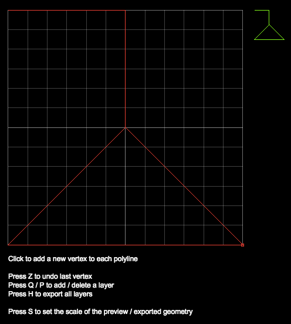

# Simplifying development tooling
_Tags: #tooling #code_
 
Written 2019-01-10

Writing code is a necessary evil to get things done on a project and often the best kind of code 
is no code at all. Good tooling helps us do things: 

- FASTER: avoid writing code when the task least requires it 
- CHEAPER: avoid writing code when results are not worth the effort
- EASIER: avoid barriers for contributors of all skill levels 

## Creating game art (EASIER)

CelCom exclusively uses vector graphics, which is one of the simplest and most space-efficient ways 
to represent art in a game. Using vector graphics is a trade off in favor of using more CPU for less disk space.
Vectors also don't lose resolution after scaling.

All art in CelCom is expressed as polygons: arrays of points in sequential order. For example, a simple triangle is
`[ [0,0], [8,0], [0,8], [0,0] ]`.
As you might imagine, art that's even a little bit more sophisticated would be very tedious to code by hand. 
If we want to easily add to and iterate our game art we need an editor that the artist can draw inside and use to export 
to our game-native vector format.

The [geometry editor tool](http://jsyang.ca/celestial?editor) was created to do this. It can also be run locally:

1. `yarn watch`
2. http://localhost:3000/?editor
 
The editor can create layers of polygons with an infinite undo history. See `LETTERS` within `src/client/constants.ts` 
for an example of the output. Further tweaks to the resulting coordinate arrays is possible with the simple helper 
function `transformPolygon()` inside [`src/client/Geometry.ts`](https://github.com/jsyang/celestial/blob/master/src/client/Geometry.ts).   



## Creating builds (FASTER + CHEAPER)

Previously the project used Webpack to create a single client-side JS file that would minimize the number of 
network requests as well as total load time. As of 2018, webpack is the standard bundler for many JS projects. 

It has a vast collection of plugins for configuring and transforming code and assets. This is also its main downside:
you need to configure these plugins individually and orchestrate them. The level of effort required for the initial setup
and continued maintenance (if you want it to build more things / more types of things) is sizable.  

`webpack.config.js` files easily become sprawling messes of interdependent configs on large projects. Occasionally 
drawing attention away from feature development simply to keep the bundler working acceptably as the codebase scales. 

Eventually, some people got sick of doing that and proposed a better approach: avoiding as much as config as possible 
while achieving the same purpose of compiling client-side resources.

### "Zero-config" bundler

[ParcelJS](https://parceljs.org) is one such alternative to the config hell that many webpack projects become. It began 
a trend of thought for build tools in 2018 that quickly gained momentum. You install a single dependency for the bundler,
point it to an entry point for each bundle / resource to produce and it takes care of the rest. 
Plugins are automatically installed when required, allowing the developer to focus more of their time on 
building features vs messing with the compilation toolchain. 

Switching over to [Parcel] vs [Webpack](https://github.com/jsyang/celestial/commit/7a5963fd952507c20e6eddbd0eed755b6fc4fca1) caused:

- 61 + 19 = 80 lines of dense config code to disappear; simply not needed!
  - replaced by a handful of `package.json` script commands
- initial "watch" build time dropped from `12.18s` to `10.85s`
  - "changed" build times dropped from order of tens of seconds to tens of milliseconds! (greatest benefit, time-wise)
- complete production build time dropped from `30.30s` to `28.21s` 
 
The timings above were gathered from running the bundlers on my 2013 Macbook Air. Parcel is the clear winner here. 
It is not completely perfect however, some things that were straightforward in Webpack 
need clever workarounds / new ways of thinking with Parcel:

1. Including resources into the bundles was not obvious: you need to `require()` sound files for instance.
See `scripts/generateSoundsList.js` and `src/client/assets/sounds.ts` as examples.

2. Some functionality was lost in regards to the Parcel plugin ecosystem not having equivalents to the Webpack counterparts:
compiling markdown (`.md`) files had to be done via a short Node script instead.

3. TypeScript support is good but the bundler does not do a typecheck during the transpilation. If you want to see
build errors, you either need editor support (IntelliJ / VSCode will do this in the background) or you need to
run the TS compiler in watch mode in a separate process.

Parcel can also be huge in terms of number of its child dependencies within `node_modules/`, whereas this is 
limited with Webpack (being explicitly defined). Not really a major concern for people not developing on limited spec
environments. Finally, the experimental scope hoisting functionality did not work well on this project owing to Parcel's
lack of maturity. It created super-minified builds that did not work.

Not quite "zero-config" but much closer than before!

## Releasing builds (CHEAPER + EASIER) 

Hosting CelCom is provided by GitHub Pages: each commit into the `master` branch of the git repository publishes the 
codebase as a statically served website hosted on GitHub CDNs. This means publishing things is simple:

- no additional hosting is needed. same as version control provider
- publishing new builds is done by modifying files and then committing them
- general public receive updates immediately: cache time is < 1 hour

All we need to do to see which builds a client is receiving is to create a readily visible build tag that has the 
timestamp of build and the commit it built from. We use the `.env` approach here offered by Parcel and regenerate it
for each production build via `scripts/generateDotEnv.js` Example:

```
BUILD_HASH=929e057
BUILD_DATE=2019-01-02T21:51:52.227Z
```
