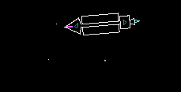
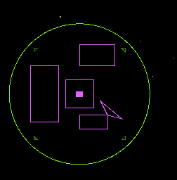
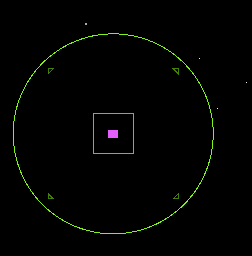
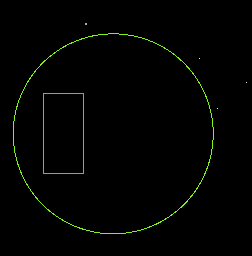
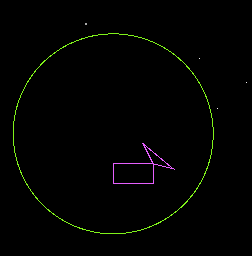
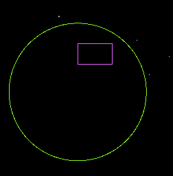
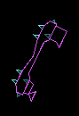

<style>
    body {
        background: #121212;
        color: #c8c8c8;
        font-family: sans-serif;
    }
</style>

<center>
    
</center>

Celestial Combat is a game of galactic trade, colonization, and conquest. 

### Keyboard controls

```
    KEY                 ACTION
    
    Left arrow key      Turn left
    Right arrow key     Turn right
    Up arrow key        Accelerate
    F                   Fire primary weapon

```

### Game play
You begin with either an invasion fleet (1 x Fighter + 4 invasion Freighters) or
a single occupied planet.

To colonize planets, you must land on them when they are unoccupied with your 
Fighter. The landing will plant a beacon, starting the flow of Freighters 
and raw materials sent to construct facilities on the planet. 

To win, you need to destroy all enemy production, combat facilities, and spacecraft.

#### Landing on planets
Before colonization can begin, you must land on a planet to secure your colonization
beacon. Approach the planet at slow speed and rotate the craft to face outwards from 
the planet's center. Failing to do this the Fighter will be destroyed.

**When you land on a friendly planet, your weapons will be rearmed and your ship repaired.**

Note: you cannot land on stars. Fighters are affected by gravity from planets and stars. 

### Weapons

- **Cannon**<br>The standard energy weapon supplied by the same power plant that drives
 a spacecraft's propulsion system.<br>`Damage: 1 per hit`
 
- **Heavy Cannon**<br>Focusing the emitters of the standard cannon allowed us to create a weapon that 
delivers twice the energy per projectile.<br>`Damage: 2 per hit`
  
- **Cluster Rocket**<br>Packed with high explosive shells, this unguided rocket can deliver 20
shells to the recipient for maximum destruction.<br>`Damage: 1 per hit x 20 shells + 0.5 impact damage`
   
- **Homing Missile**<br>We have developed cheap, miniaturized, biological prey-seeking intelligence
that is installed into every mass produced homing missile; a highly destructive weapon.<br>`Damage: 6 per hit`
    
- **Laser Bolt**<br>Fast discharge ultra-capacitors have enabled our technicians to pack a devastating laser weapon
into a small space.<br>`Damage: 30 per hit, ranged` 

### Units

##### Fighter


The backbone of an offensive fighting force is the standard GHX-12 Fighter
craft armed with a rapid-fire cannon. Fighters can lay claim to unoccupied
planets.

```
Speed           ||||||||||
Firepower       |||||||...
Armor           |||.......
Storage         |.........
```

##### Freighter 



Transport for raw and finished materials is provided primarily by Freighters.
They carry the capability to speed up construction of essential 
fortifications and facilities. Freighters are the only craft capable of constructing
a Planetary Base (PBase).

```
Speed           ||........
Firepower       |||....... 
Armor           ||||......
Storage         ||||||||||
```

### Facilities



##### PBase



A Planetary Base (PBase) provides a planet with basic production and mining operations.
It can harvest and store raw materials on the planet. It can construct a Communications
Center and a Planetary Lab. It also provides defensive weapons, allowing the planet to 
defend itself from attackers. 

```
Speed           ..........
Firepower       |||||..... 
Armor           ||||||||..
Storage         ||||......
```

##### PColony



A Planetary Colony (PColony) is the most efficient way for a planet to produce finished
materials from raw materials. It can construct spacecraft and other facilities; its operation
is critical to the maintenance demands of a planet. 

```
Speed           ..........
Firepower       .......... 
Armor           |||.......
Storage         |||||||...
```

#### PComm



Galactic scanners installed in the Planetary Communications (PComm) allow
empires to track precise locations of other worlds. A galactic radar display is
active when your faction owns at least one functional PComm.

```
Speed           ..........
Firepower       .......... 
Armor           ||........
Storage         ..........
```
 
#### PLab



Weapons technology research and new weapon installation is carried out from the 
Planetary Lab.

```
Speed           ..........
Firepower       .......... 
Armor           |.........
Storage         ||........
```  

#### Spaceport, SpaceDock, SensorArray



The orbital Spaceport and its facilities allow the Fighter craft to be swiftly repaired and
rearmed. As it is the first point of defense for a planet, it is heavily armed and armored.  

```
Speed           |.........
Firepower       ||||||.... 
Armor           |||||||...
Storage         ||||......
```  

## Gamepad controls

```
    KEY                 ACTION
    
    Analog stick        Set craft direction
    Button 0            Fire primary weapon
    Button 2            Accelerate

```

## Acknowledgements

Gameplay inspired by and based on [Gravity Well v2.2 (circa 1995)](https://archive.org/details/GWELL22), the planetary 
conquest game by David H. Hoeft of Software Engineering Inc. 